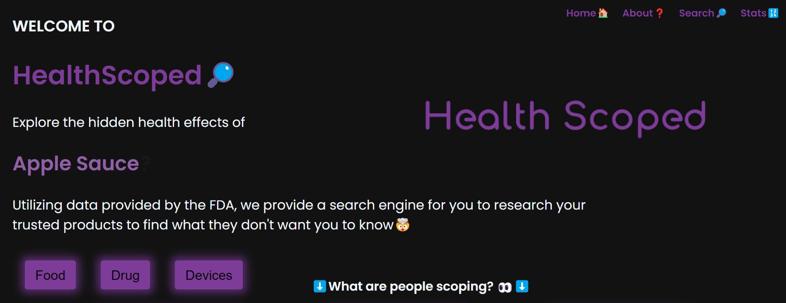

# [HealthScoped](https://healthscoped.vercel.app/)🔎

We hope to create a easy to use search engine for consumers to learn more about the health effects that popular products can cause. From drugs to foods our platform uses trusted data from the FDA to provide you with the information you need to make descisions.

Website: https://healthscoped.vercel.app/

### Targeted Browsers 🌐
- Google Chrome (Desktop) 

## Developer Manual 💻
### Installation Guide ⬇️
1. **Install Node.js**:
   - Visit https://nodejs.org/ to download the latest node.js
2. **Clone the Repo**
    - Clone this repo to your workspace `git clone https://github.com/SayyedAdnan/HealthScoped.git`
3. **Install dependencies**
    - Run `npm install` to install all needed dependencies for the React website
4. **Change Environment Variables**
    - Replace the Supabase URL and token with your own.
6. **Host the website**
    - Using `npm start` will allow you to view the website on a local server. (http://localhost:3000)
### API Endpoints 🧑‍💻
The application itself does not host any API endpoints but it does use the Supabase API endpoints to both POST and GET from the database
## Future Roadmap 🚧
- Implement advanced custom filters for searches
- Expand to include Drugs and Devices
- Display data visualization from data
